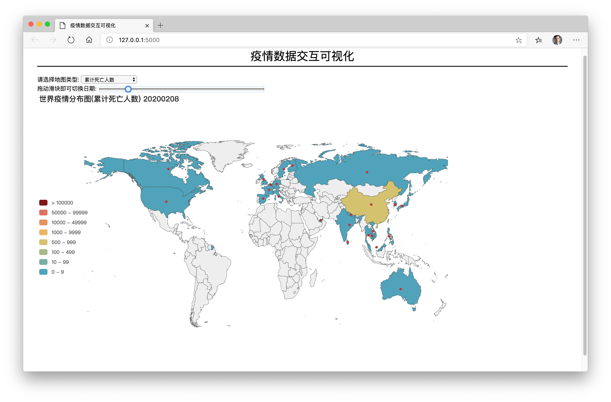

# 🦠新冠肺炎疫情数据动态交互可视化(时空交互）

> Tips:交互可视化图表运行步骤

  1. 下载项目压缩包[点击下载](https://gitee.com/autumnhui/Learn_PythonDA/raw/master/%E5%AE%9E%E8%B7%B5%E9%A1%B9%E7%9B%AE/Prj_Covid-19/Prj_Covid-19.zip)
  2. 解压后运行  ```app.py``` 文件(需安装相关模块)
  3. 浏览器打开地址：127.0.0.1:5000

---

# 项目名称：新冠肺炎疫情数据动态交互可视化

## 项目背景

[**新型冠状病毒肺炎（Corona Virus Disease 2019，COVID-19）**](https://baike.baidu.com/item/%E6%96%B0%E5%9E%8B%E5%86%A0%E7%8A%B6%E7%97%85%E6%AF%92%E8%82%BA%E7%82%8E/24282529?fromtitle=%E6%96%B0%E5%86%A0%E8%82%BA%E7%82%8E&fromid=24330426&fr=aladdin)，简称“新冠肺炎”，世界卫生组织命名为“2019冠状病毒病”，是指2019新型冠状病毒感染导致的肺炎。

## MVP数据加值主张宣言

在全球抗击新型冠状病毒疫情的过程中，出现了大量的数据，在此项目中，**我们用数据展示了疫情在全球的传播影响的动态变化。**让我们能够直观看出疫情的传播，以分析疫情的传播，利用数据分析技术和方法**能够协助发现病毒传染源、监测疫情发展、调配救援物资，从而更好地进行疫情防控工作。**


## 问题情境的数据来源及类型

- 查看疫情的动态发展
- 医务人员、政府相关部门、世卫组织、对疫情有持续动态关注的人等
- 从Github开源项目获取数据，可收集并分析
- 数据来源与问题密切相关
- 数据类型有时间以及空间的信息，恰好用以做时空分析

## 解决方案

- 数据分析思路及方法：取空间、时间数据作为基础，加以确诊人数、疑似人数、死亡人数的数据进行展示。
- 对有需要的人进行时空数据展示，用户可欲性强。
- 数据分析结果已实现，技术可行性没问题。
- 可以拿去供相关需求者（如某些新冠肺炎的医疗公司）进行展示，商业可行。

## 数据分析

- 二月底三月初，国内确诊人数逐渐减少，国外此时开始大规模出现感染并扩散到多个国家；此时意大利、伊朗疫情较为严重；疫情开始扩散到非洲、南美洲；
- 三月中旬后，国内疫情已经基本得到控制，而世界上大部分国家都已出现确诊报告，许多国家突破五位数确诊；其中欧洲和伊朗、美国较为严重；
- 四月初，国内确诊人数继续减少，国外疫情几乎已经扩散到世界所有国家，其中美国确诊人数已经突破20万，是世界最严重的地区；
- 国外疫情在四五月份继续趋向严重，在5.8美国的确诊人数突破百万；但部分早期疫情严重的国家由于采取了有效的控制手段导致疫情缓解；
- 二月初，世界各国开始出现死亡病例；
- 国内的死亡病例数在二月中旬趋向平缓；
- 在三月中旬，世界各国死亡病例陆续出现或开始明显增多；
- 在五月份，报告的死亡数以美国、欧洲最为严重，许多国家死亡人数已经远远超过了中国；
- 死亡率也可以反应出疫情的控制程度，死亡率越低表明患者得到救治的概率越大；
- 在医疗资源充足的地区，死亡率可以降低到1%左右；医疗资源不足的地区，死亡率可以高达10%；


### 分析总结

1. 数据可通过成果展示分析。
2. 时间段完整，有细节展示；并分了3类（确诊、疑似、死亡）
3. 数字人文/社会数据科学分析明确且合理有效

## 心得总结及感谢

### 心得总结

数据有很多，但是如何去利用数据得出有价值的东西才是最重要的。利用数据我们可以获取到很多的信息。枯燥的数字远不及图表来的简单，且更加直观明显。

### 感谢

感谢[**CSDN**](csdn.net)用户提供解决问题的代码，

感谢[**Github开源**](https://github.com)，

感谢[**Github提供开放数据**](https://github.com/datasets/covid-19/)

感谢[**shineych大神的帮助**](https://blog.csdn.net/shineych/article/details/104231072)

感谢一学期来各位老师的辛勤教导。

---

## 1. 数据分析描述

### 1.1 数据源

- china_provincedata.csv 中国各省、直辖市、自治区、特别行政区的疫情数据

- countrydata.csv 全球214个国家地区以及钻石公主号邮轮的疫情数据

### 1.2 数据分析目标

- 📁china_provincedata.csv 有效数据参数
  - confirmedCount：确诊数
  - curedCount：治愈数
  - currentConfirmedCount：现存确诊数
  - dateId：日期
  - deadCount：死亡数
  - suspectedCount：疑似数
  - provinceName：省份名
  - provinceShortName：省份缩写
  - 数据集展示
  
---

- 📁countrydata.csv 有效数据参数
  - confirmedCount：确诊数
  - curedCount：治愈数
  - currentConfirmedCount：现存确诊数
  - dateId：日期
  - deadCount：死亡数
  - suspectedCount：疑似数
  - countryName：国家名名
  - countryShortName：国家缩写
  - 数据集展示

用的两个数据集已经是非常工整的数据，只需要取想要的列即可，无需再去进行进一步清洗。

### 1.3 数据分析结果

新型冠状病毒肺炎（Corona Virus Disease 2019，COVID-19），简称“新冠肺炎”，世界卫生组织命名为“2019冠状病毒病”，是指2019新型冠状病毒感染导致的肺炎。
在全球抗击新型冠状病毒疫情的过程中，出现了大量的数据，在此项目中，**我们用数据展示了疫情在全球的传播影响的动态变化。**让我们能够直观看出疫情的传播。

### 1.4 数据分析结果可视化

- 使用的图表模块：
  - [**pandas**](https://pandas.pydata.org/)
  - [**pyecharts**](http://pyecharts.herokuapp.com/)

使用pandas处理相关数据，pyecharts进行可交互的图像输出，再使用🌶Flask🌶进行部署至网页。


## 2.数据分析电子档

- 项目人：丘天惠
- 时间：2020.7.16
- 数据源：
  - china_provincedata.csv
  - countrydata.csv
- 目标：用数据展示疫情在全球的传播影响的动态变化。

## 交互示例：



